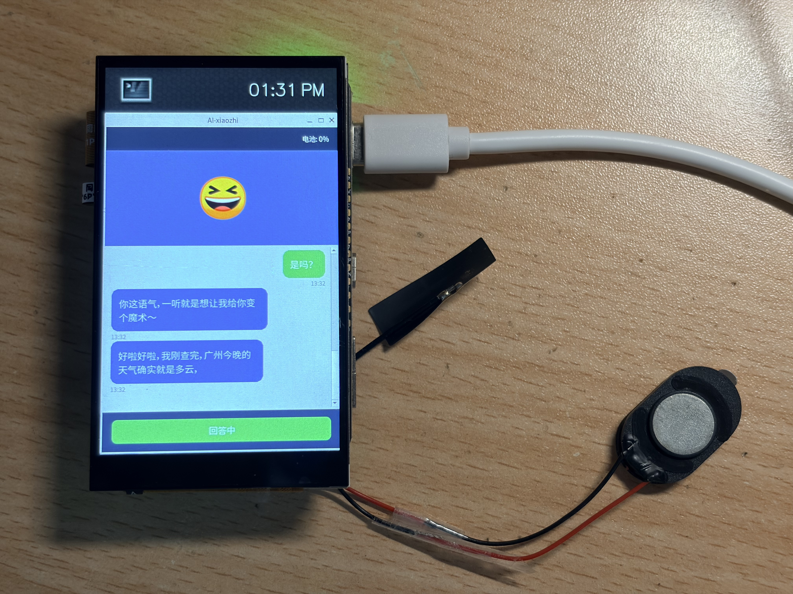
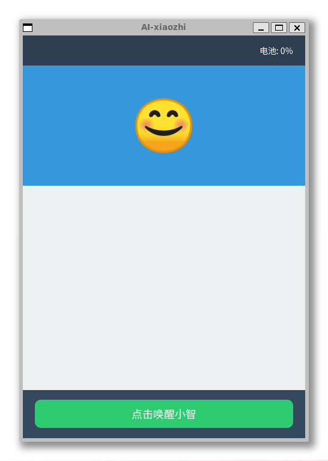
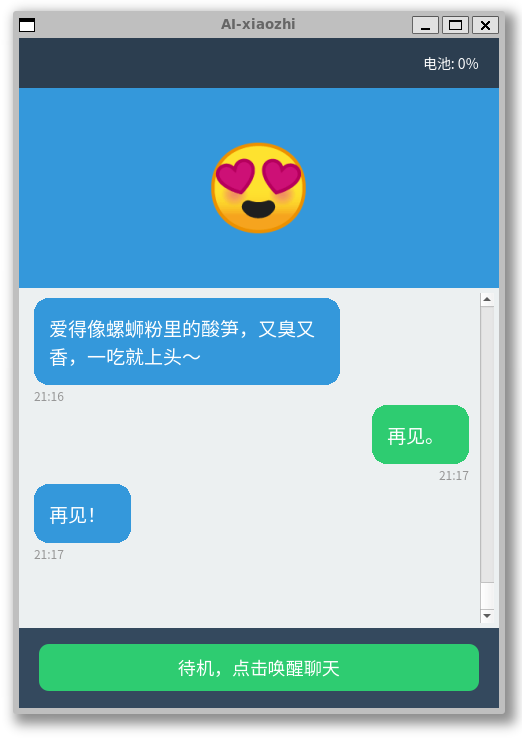

# 小智 AI 聊天机器人【泰山派版本】

项目来源于 [韦东山老师的xiaozhi-linux](https://gitee.com/weidongshan/xiaozhi-linux)，为了适配多平台，基于 CMake 进行了重构，支持 Ubuntu 本地调试与 RK3566（泰山派）嵌入式交叉编译，同时集成 Google Test 单元测试。

# 运行
先要联网，然后运行以下的命令

添加可执行权限：
```bash
chmod +x my_sound
chmod +x qt_gui
chmod +x my_control_center
```

运行：
```bash
./my_sound &
./qt_gui &
./my_control_center
```



# 后续计划

 - [x] gui 为 简易的 CLI 界面，核心功能为通过 UDP IPC 接收 JSON 格式的 UI 数据，解析后在终端输出关键字段信息，后续工作是改成基于QT的界面。
 - [x] 基于面向对象重构 ctrl_center

## qt-gui

这是基于qt的简易gui界面，用Claude开发的，如下图所示：






## 基于面向对象重构 ctrl_center

### 1. 重构背景与目标
#### 1.1 原代码痛点（C 过程式）
1. **全局变量泛滥**：设备状态、通信句柄、配置参数均为全局变量，线程不安全、易引发数据竞争；
2. **C 风格回调缺陷**：函数指针无类型安全、无法绑定上下文，扩展性极差；
3. **资源手动管理**：套接字、线程需手动创建/释放，易造成内存泄漏、野指针、程序崩溃；
4. **无抽象设计**：通信模块无统一接口，新增通信方式需重构核心代码。

#### 1.2 重构核心目标
1. **模块化拆分**：按功能划分为独立模块，职责单一、解耦彻底；
2. **面向对象封装**：消除全局变量，数据与行为封装为类私有成员；
3. **抽象接口设计**：统一通信层接口，支持快速扩展通信方式；
4. **现代化改造**：替换 C 语言老旧语法，使用 C++11/14 特性实现类型安全、线程安全；
5. **自动化资源管理**：基于 RAII 机制自动释放资源，杜绝内存泄漏与崩溃。

---

### 2. 核心重构思路（模块化 + 面向对象封装）
本次重构将整个系统**按功能职责划分为 3 大核心模块**，基于**封装、继承、多态**完成面向对象设计，模块间通过标准接口交互，无直接依赖。

#### 2.1 整体模块划分
```
小智中控中心
├── 1. IPC 通信模块（跨进程通信层）
│   ├── 抽象基类：IpcEndpoint（统一通信接口）
│   └── 实现类：UdpEndpoint（UDP 协议具体实现）
├── 2. WebSocket 通信模块（云端通信层）
│   └── 实现类：WebSocketClient（TLS WebSocket 客户端封装）
└── 3. 核心业务控制模块（业务逻辑层）
    └── 实现类：XiaozhiControlCenter（单例中控核心，整合所有模块）
```

#### 2.2 各模块面向对象封装设计（功能 + 接口）
##### 模块一：IPC 通信模块（跨进程通信层）
**设计理念**：**抽象接口 + 具体实现分离**，基于多态实现统一通信标准，支持任意 IPC 协议扩展。
1. **抽象基类：IpcEndpoint**
    - **封装定位**：IPC 通信**抽象接口层**，定义所有跨进程通信的通用行为，不涉及具体协议；
    - **核心功能**：统一数据发送、接收、回调标准，约束子类实现；
    - **面向对象特性**：纯虚函数、抽象类、多态；
    - **核心接口**：
      - `send(const uint8_t* data, size_t len)`：纯虚函数，发送数据（子类必须实现）；
      - `recv(uint8_t* buffer, size_t maxlen)`：纯虚函数，接收数据（子类必须实现）；
      - `setRecvCallback(RecvCallback cb)`：设置数据接收回调。

2. **实现类：UdpEndpoint**
    - **封装定位**：IPC 通信**具体实现层**，继承 `IpcEndpoint`，专注 UDP 协议实现；
    - **核心设计**：**双 Socket 收发分离架构**（发送专用 Socket + 接收专用 Socket）；
    - **核心功能**：UDP 数据收发、后台异步接收、线程安全、自动资源释放；
    - **面向对象特性**：继承、重写、RAII、线程封装；
    - **核心接口**：
      - `UdpEndpoint(int listen_port, int send_target_port, const std::string& ip)`：构造函数（初始化端口/IP）；
      - `send(const uint8_t* data, size_t len) override`：重写发送接口；
      - `recv(uint8_t* buffer, size_t maxlen) override`：重写接收接口；
      - `~UdpEndpoint() noexcept`：析构函数（自动关闭 Socket、停止线程）。

---

##### 模块二：WebSocket 通信模块（云端通信层）
**设计理念**：**全封闭封装**，将 WebSocket 连接、TLS 认证、消息收发、回调处理全部封装为独立类，对外暴露极简接口。
1. **实现类：WebSocketClient**
    - **封装定位**：云端 TLS WebSocket 通信**独立组件**，无任何全局依赖；
    - **核心功能**：WebSocket 连接建立、消息收发（二进制/文本）、TLS 证书验证、异步回调、后台线程运行；
    - **面向对象特性**：封装、禁用拷贝、RAII、原子变量；
    - **核心接口**：
      - `WebSocketClient(...)`：构造函数（初始化服务器地址、握手消息、请求头）；
      - `set_callbacks(...)`：设置数据接收/连接关闭回调；
      - `start()`：启动客户端（后台线程运行）；
      - `send_binary/send_text`：发送数据；
      - `is_connected() const`：获取连接状态；
      - `~WebSocketClient()`：自动断开连接、释放资源。

---

##### 模块三：核心业务控制模块（业务逻辑层）
**设计理念**：**单例模式**，作为系统唯一核心中控，整合所有底层模块，处理业务逻辑、设备管理、协议解析。
1. **实现类：XiaozhiControlCenter**
    - **封装定位**：系统**业务核心调度层**，唯一对外入口，管理所有硬件、通信、业务逻辑；
    - **核心功能**：硬件信息（MAC/UUID）初始化、设备激活、UDP/WebSocket 模块管理、设备状态同步、协议解析、业务回调处理；
    - **面向对象特性**：单例模式、封装、智能指针、原子变量；
    - **核心接口**：
      - `instance()`：获取单例实例；
      - `run()`：主入口，启动整个中控系统；
    - **私有成员**：
      - 硬件信息（mac_/uuid_）、通信组件（UDP/WebSocket 智能指针）；
      - 线程安全状态变量（设备状态、音频上传开关）。

### 2.3 模块间协作关系
1. **XiaozhiControlCenter** 作为**上层业务核心**，聚合 IPC 通信模块 + WebSocket 模块；
2. 业务层不关心底层通信实现，仅通过**标准接口**调用通信模块；
3. 通信模块通过**回调函数**将数据上报给业务层处理；
4. 所有模块**无循环依赖**，可独立编译、测试、替换。

---

### 3. 应用的 C++ 高级语法/新特性（C++11/14）
重构代码全面使用现代 C++ 特性，替代老旧 C 语法，提升代码**安全性、性能、可维护性**：

| C++ 特性 | 作用 | 对应代码位置 |
|---------|------|-------------|
| **强类型枚举 `enum class`** | 避免命名冲突、类型安全，替代 C 语言 `typedef enum` | `XiaozhiControlCenter` 设备状态/监听模式 |
| **`std::atomic` 原子变量** | 多线程无锁安全访问共享变量，解决数据竞争 | 连接状态、设备状态、音频上传开关 |
| **`std::unique_ptr` 智能指针** | 独占式智能指针，自动释放动态对象，无内存泄漏 | 管理 `WebSocketClient`/`UdpEndpoint` 实例 |
| **`std::function`** | 类型安全回调，替代 C 语言函数指针，支持任意可调用对象 | IPC/WebSocket 回调定义 |
| **Lambda 表达式** | 匿名函数，便捷绑定上下文，简化异步回调编写 | UDP 接收回调、WebSocket 回调绑定 |
| **`using` 类型别名** | 替代 `typedef`，语法更简洁，支持模板 | 回调类型、WebSocket 客户端重定义 |
| **`=delete` 禁用函数** | 禁止类的拷贝/移动，杜绝非法实例操作 | 单例类、通信类禁用拷贝 |
| **纯虚函数 + 抽象基类** | 实现接口与实现分离，支持多态 | `IpcEndpoint` 抽象通信接口 |
| **RAII 资源获取即初始化** | 构造初始化资源，析构自动释放，无需手动管理 | 所有类的 Socket/线程资源管理 |
| **移动语义 `std::move`** | 减少对象拷贝，提升性能 | 回调函数赋值优化 |
| **单例模式** | 保证全局唯一实例，适配中控常驻运行特性 | `XiaozhiControlCenter` 核心类 |
| **继承与函数重写** | 复用抽象接口，实现具体协议逻辑 | `UdpEndpoint` 继承 `IpcEndpoint` |
| **访问控制（private/protected）** | 隐藏内部实现，仅暴露必要接口，实现高内聚 | 所有核心类封装 |

---

### 4. 重构后架构优势
1. **模块化解耦**：三大模块职责单一，互不干扰，可独立维护、扩展、替换；
2. **高可扩展性**：IPC 通信基于抽象基类，可无缝扩展管道、共享内存等通信方式；
3. **线程安全**：原子变量+智能指针，彻底解决多线程数据竞争问题；
4. **稳定性极高**：RAII 自动管理资源，杜绝内存泄漏、野指针、段错误；
5. **可测试性强**：独立模块支持单元测试，无需依赖整个系统；
6. **现代化规范**：符合现代 C++ 编码标准，降低后续维护成本。
